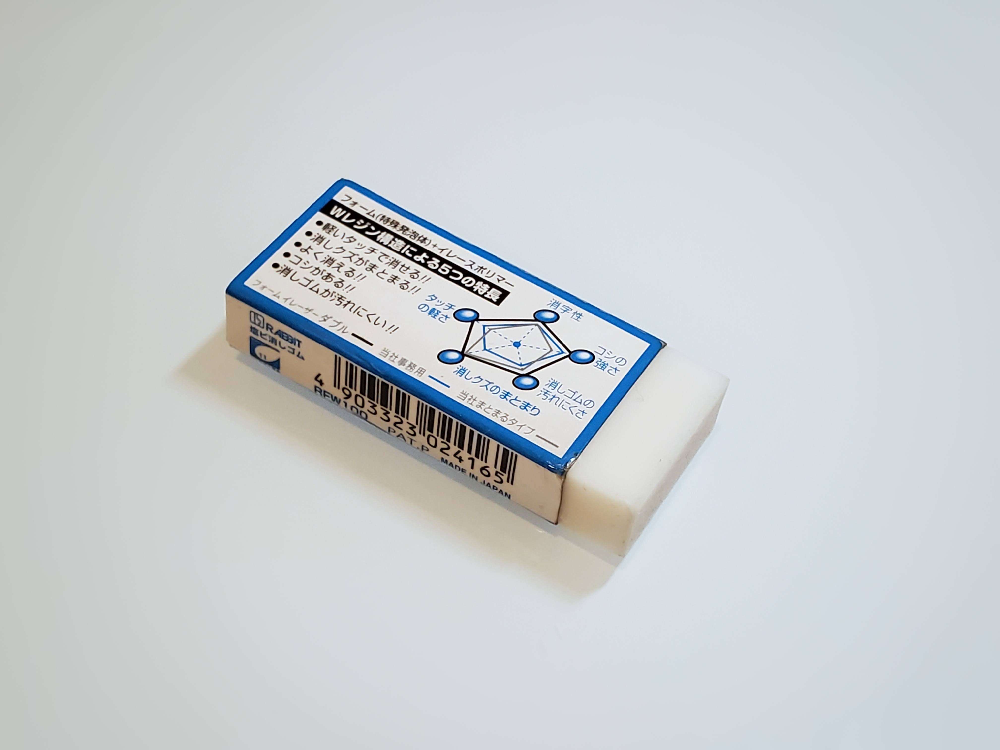

![github-issues-shield]


[![MIT License][license-shield]][license-url]
[![LinkedIn][linkedin-shield]][linkedin-url]

<!-- PROJECT LOGO -->
<br />
<p align="center">
  <a href="https://github.com/Skyline-9/U2-Background-Removal">
    
  </a>

  <h3 align="center">U2 Background Removal</h3>

  <p align="center">
    Deep Learning based background removal built with U<sup>2</sup>-Net: U Square Net (Xuebin Qin, Zichen Zhang, Chenyang Huang, Masood Dehghan, Osmar R. Zaiane and Martin Jagersand)
    <br />
    <br />
    <a href="https://arxiv.org/pdf/2005.09007.pdf"><strong>Read the original paper »</strong></a>
    <br />
    <br />
  </p>
</p>

<!-- TABLE OF CONTENTS -->
<details open="open">
  <summary>Table of Contents</summary>
  <ol>
    <li>
      <a href="#introduction">Introduction</a>
    </li>
    <li>
      <a href="#model">Model</a>
      <ul>
        <li><a href="#residual-u-block-rsu">ReSidual U-Block (RSU)</a></li>
        <li><a href="#architecture">Architecture</a></li>
        <li><a href="#loss-function">Loss Function</a></li>
      </ul>
    </li>
    <li><a href="#citation">Citation</a></li>
  </ol>
</details>

<!-- INTRODUCTION -->
## Introduction

<p align="center">
  <strong align="center">Why U<sup>2</sup>-Net?</strong>
  <br>
  
</p>
  
Removing the background of a picture is an old problem, but traditional CV algorithms such as image thresholding fall short without intensive pre/post processing, and even then, the task is very difficult when the object has colors similar to the background.

With recent advances in DL literature, Saliency Object Detection (SOD) has emerged as one of the predominate ways to separate foreground and background. In short, SOD is a task based on segmenting the most visually attractive objects in an image, typically by creating a saliency map to distinguish the important foreground from the background.

Most SOD networks work based on using features extracted by existing backbones such as AlexNet, VGG, ResNet, ResNeXt, and DenseNet. However, the problem is that all of these backbones are originally designed for image classification, meaning they "extract features that are representative of semantic meaning rather than local details and global contrast information, which are essential to saliency detection."

For the International Conference on Pattern Recognition (ICPR) 2020, Qin et al. proposed a novel network for SOD called U<sup>2</sup>-net that allows training from scratch and achieves comparable or better performance than those based on existing pre-trained backbones.

<!-- Model -->
## Model
### ReSidual U-Block (RSU)


Qin et al. proposed a novel block called RSU, consisting of
1. An input convolution layer which transforms the feature map to an intermediate map
2. A U-Net like symmetric encoder-decoder structure which takes the intermediate feature map as input and learns to extract and encode the multi-scale
contextual information
3. A residual connection which fuses local features and the multi-scale features

### Architecture


### Loss Function


<!-- Citation -->
## Citation
```
@InProceedings{Qin_2020_PR,
title = {U2-Net: Going Deeper with Nested U-Structure for Salient Object Detection},
author = {Qin, Xuebin and Zhang, Zichen and Huang, Chenyang and Dehghan, Masood and Zaiane, Osmar and Jagersand, Martin},
journal = {Pattern Recognition},
volume = {106},
pages = {107404},
year = {2020}
}
```

<!-- MARKDOWN LINKS & IMAGES -->
[github-issues-shield]: https://img.shields.io/github/issues/skyline-9/u2-background-removal?style=for-the-badge
[top-language-shield]: https://img.shields.io/github/languages/top/skyline-9/u2-background-removal?color=orange&style=for-the-badge
[license-shield]: https://img.shields.io/github/license/Skyline-9/U2-Background-Removal?style=for-the-badge
[license-url]: https://github.com/Skyline-9/U2-Background-Removal/blob/main/LICENSE
[linkedin-shield]: https://img.shields.io/badge/LinkedIn-blue?style=for-the-badge&logo=linkedin&labelColor=blue
[linkedin-url]: https://www.linkedin.com/in/richardluorl
